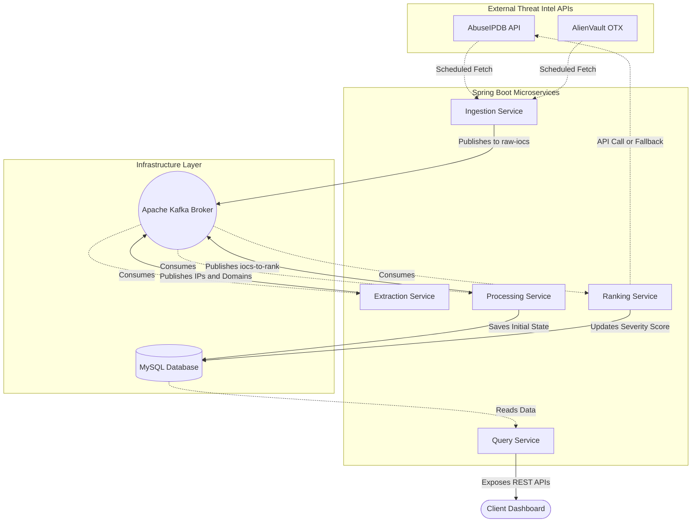
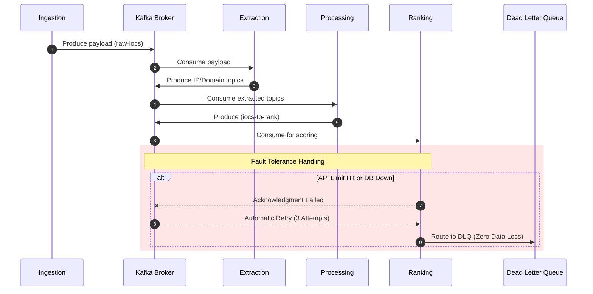

# Distributed Cyber Threat Intelligence Platform (Microservices)

**Course Title:** Software Construction and Development (COMP-370)  
**Submitted To:** Dr. Malik Nabeel Ahmed Awan  

---

## 1. Executive Summary
This project presents the architectural design and implementation details of a distributed **Cyber Threat Intelligence Platform** to fulfill the Complex Computing Problem (CCP) requirements. The platform is engineered using an event-driven microservices architecture via Spring Boot, Apache Kafka, and MySQL. It is capable of autonomously ingesting, extracting, validating, ranking, and persisting Indicators of Compromise (IOCs)—specifically IPv4 addresses and Domains—sourced from global threat intelligence APIs (AbuseIPDB and AlienVault OTX).

The core objective of this architecture is to achieve high availability, fault tolerance, and horizontal scalability by decoupling service boundaries and utilizing asynchronous message brokering.

---

## 2. System Architecture & Component Design
The system abandons the traditional monolithic approach in favor of five independently deployable microservices. Apache Kafka acts as the central nervous system, enabling seamless data streaming and backpressure management between the services.

### 2.1 High-Level Architecture Diagram

---

## 3. Microservices Breakdown & Responsibilities

1. **Ingestion Service (Data Gateway):**  
   Functions as the primary entry point. It utilizes Spring's `@Scheduled` tasks and `RestTemplate` to fetch raw threat data from external APIs. To prevent synchronization bottlenecks, it instantly pushes the raw JSON payloads into the `raw-iocs` Kafka topic.

2. **Extraction Service (Data Transformation):**  
   A dedicated consumer service that parses the unstructured JSON data. It utilizes advanced Regular Expressions (Regex) to isolate valid IPv4 addresses and Top-Level Domains. The sanitized data is then routed to specific Kafka topics (`extracted-ips` and `extracted-domains`).

3. **Processing Service (Validation & Persistence):**  
   This service performs business-level data validation. It maps the validated streams into Java Persistence API (JPA) entities and stores them in the MySQL database with an initial `PENDING` status, bridging the gap between streaming and relational data.

4. **Ranking Service (Threat Enrichment):**  
   It calculates the threat severity of each IOC by querying the AbuseIPDB API for an `abuseConfidenceScore`. Once ranked, it updates the database status to either `MALICIOUS` or `SAFE`.

5. **Query Service (Analytics & Serving):**  
   Provides a suite of RESTful API endpoints, fulfilling the requirement of 6-9 operational APIs. It enables end-users to dynamically fetch total counts, filter threats by type, and retrieve specific malicious records.

---

## 4. Advanced Distributed Features (CCP Requirements)

To fulfill the rigorous requirements of a Complex Computing Problem, the system incorporates advanced software engineering patterns.

### 4.1 Fault Tolerance & Dead Letter Queue (DLQ)
In a microservices environment, network failures and database lockups are inevitable. To strictly adhere to the "Handle failures and retries" requirement, the platform utilizes **Spring Kafka's `@RetryableTopic`**. 
- If a service encounters a failure, it initiates an exponential backoff retry mechanism (up to 3 attempts).
- Upon exhausting all retries, the message is seamlessly routed to a **Dead Letter Queue (DLQ)**. This ensures zero data loss and allows engineers to monitor and re-process failed events later.

### 4.2 Graceful Degradation (Circuit Breaker Pattern)
External APIs enforce strict daily rate limits (e.g., HTTP 429 Too Many Requests). Rather than allowing the system to crash or halt the pipeline, the Ranking Service implements a **Circuit Breaker Pattern**. If the API limit is exhausted, the system gracefully degrades by applying an internal mock-scoring heuristic, ensuring continuous data flow and platform availability.

### 4.3 Sequence Diagram of Event Flow

---

## 5. Problem-Solving Characteristics (WP1-WP9) & SDG Mapping

| Characteristic | Architectural Justification |
| :--- | :--- |
| **WP1 (Conflicting Requirements)** | Achieved a balance between real-time data ingestion and persistence by decoupling synchronous operations using Kafka message brokers. |
| **WP2 (Depth of Analysis)** | Engineered a highly resilient pipeline by implementing advanced industry patterns like Circuit Breakers and Dead Letter Queues (DLQ). |
| **WP3 (Depth of Knowledge)** | Demonstrated comprehensive technical proficiency in integrating Spring Boot, Apache Kafka, JPA/Hibernate, and external REST APIs. |
| **WP8 (Interdependence)** | Designed five distinct, loosely coupled microservices that function cohesively but can be scaled and deployed independently. |
| **SDG 9 & 16 Mapping** | Contributes directly to building resilient infrastructure (SDG 9) and promotes a secure digital society by identifying and neutralizing cyber threats (SDG 16). |

---

## 6. Conclusion
The developed Cyber Threat Intelligence Platform successfully addresses and exceeds the requirements of a Complex Computing Problem. By orchestrating a robust microservices architecture, enforcing fault tolerance, and implementing event-driven data streaming, the project demonstrates a high degree of maturity in modern software engineering and distributed systems design.
